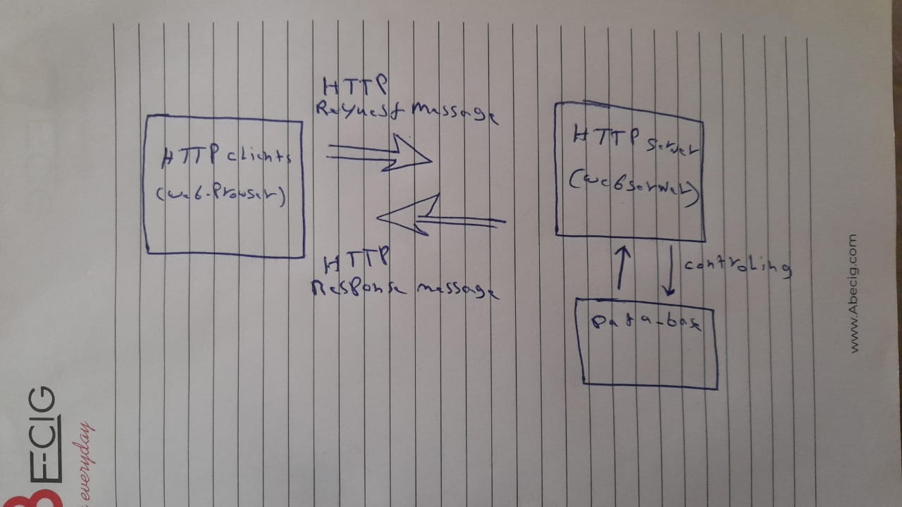

# Movies-Library
Add Documentation in your README file
# Project Name - Project Version
Movies-Library -V1

**Author Name**:Muath Mhawich

## WRRC

## Overview
This project is a simple Movie Data API built using Node.js and Express. It provides endpoints to retrieve movie data in JSON format.
## Getting Started
clone the repository to your local machine.
Navigate to the project directory
Install dependencies like 'npm install'
Start the server 'npm start'

## Project Features
Retrieve movie data: The API provides an endpoint to retrieve movie data in JSON format.
Error handling: The API includes error handling middleware to handle server errors (status 500) and "page not found" errors (status 404).
## What observations or questions do you have about what you’ve learned so far?
API Key Handling: It's crucial to securely handle API keys, whether by using environment variables or other secure methods. In this case, the error with the 401 status code suggests there might be an issue with how the API key is being used or passed to the API.
Error Handling: Effective error handling is essential in any application, especially when making API requests. It ensures that errors are properly caught and handled, preventing the application from crashing or exposing sensitive information.
Understanding API Responses: It's important to understand the structure of API responses and how to parse the data appropriately. This includes handling different status codes and response formats to provide meaningful feedback to users.
Routing and Endpoint Design: Designing clear and logical routes and endpoints is essential for building a well-structured API. This includes considering RESTful principles and organizing routes in a logical manner.
Testing: Testing APIs thoroughly is essential to catch potential issues early on. This includes both unit tests for individual functions and integration tests to ensure that the API endpoints function correctly as a whole.
## How long did it take you to complete this assignment? And, before you started, how long did you think it would take you to complete this assignment?

I wasn't keeping track of the exact time, but it probably took me around 30-40 minutes to complete this assignment, including reviewing and debugging the provided code, making necessary adjustments, and providing explanations and suggestio